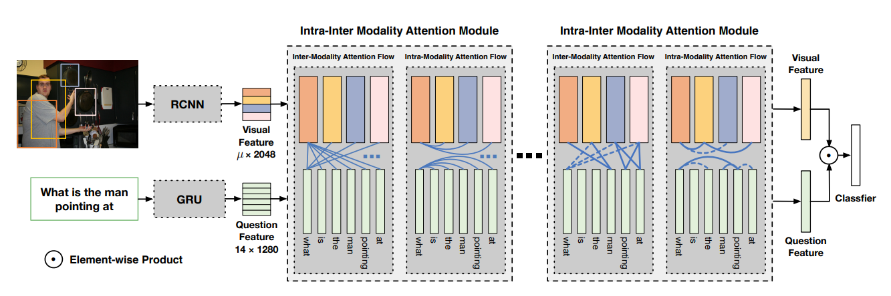

# DM6190-SPECIAL TOPIC Assignment 1

This is my coursework for DM6190-SPECIAL TOPIC Assignment 1. This repository contains the reimplementation from the paper titled '[Dynamic Fusion with Intra- and Inter-modality Attention Flow for Visual Question Answering](https://arxiv.org/pdf/1812.05252.pdf)' which was published on CVPR 2019. I took reference from [KaihuaTang/VQA2.0-Recent-Approachs-2018.pytorch](https://github.com/KaihuaTang/VQA2.0-Recent-Approachs-2018.pytorch) and reimplemented the model codes instead. The reason for this is I wanted to pay more attention to the model instead of the data preprocessing which is quite standard and easily found on the net. More details have been noted in the submitted assigment report. 



## Getting Started

To download the dataset, please follow instruction from [Cyanogenoid/vqa-counting](https://github.com/Cyanogenoid/vqa-counting/tree/master/vqa-v2).

### Prerequisites

* Pytorch 1.0.1
* Cuda V9.1.85
* Python 3.7.3

## Training

To train the model, make sure that you have downloaded the dataset following the instruction from [Cyanogenoid/vqa-counting](https://github.com/Cyanogenoid/vqa-counting/tree/master/vqa-v2). Then, to train the network, you will need to run the command below:


```
python train.py
```

To resume the training

```
python train.py --resume logs/[name of the model].pth
```

## Pretrained model

If you want to run my own implementation you can do the following steps.

1. To load it *without* q-aware network, 
    - download pretrained model from [pretrained_dfaf_parallel](https://drive.google.com/open?id=18SHsx9wmVQ38wvLWls6uAEYj7Gs2roBU), 
    - put it in *logs* folder, 
    - go to config.py
    - change *exp_id* to *1*

or...

2. To load it *with* q-aware network, 
    - download pretrained model from [pretrained_dfaf_parallel_with_q-aware](https://drive.google.com/open?id=18SHsx9wmVQ38wvLWls6uAEYj7Gs2roBU), 
    - put it in *logs* folder, 
    - go to config.py
    - change *exp_id* to *2*

Once you have done the setup, run the following command to generate the test result with the corresponding pretrained model

```
python train.py --test --resume logs/[name of the model].pth
```

## Testing

To test the model on the test standard dataset, run the command below:

```
python train.py --test --resume logs/[name of the model].pth
```


## Authors

* **Peng Gao, Zhengkai Jiang, Haoxuan You,Pan Lu, Steven Hoi, Xiaogang Wang, Hongsheng Li** - *Original Paper* - [Dynamic Fusion with Intra- and Inter-modality Attention
Flow for Visual Question Answering](https://arxiv.org/pdf/1812.05252.pdf)
* **Kaihua Tang** - *Initial implementation* - [VQA2.0-Recent-Approachs-2018.pytorch](https://github.com/KaihuaTang/VQA2.0-Recent-Approachs-2018.pytorch)

## Acknowledgments

* Kaihua Tang
* Peng Gao
* Zhengkai Jiang
* Haoxuan You
* Pan Lu
* Steven Hoi
* Xiaogang Wang
* Hongsheng Li